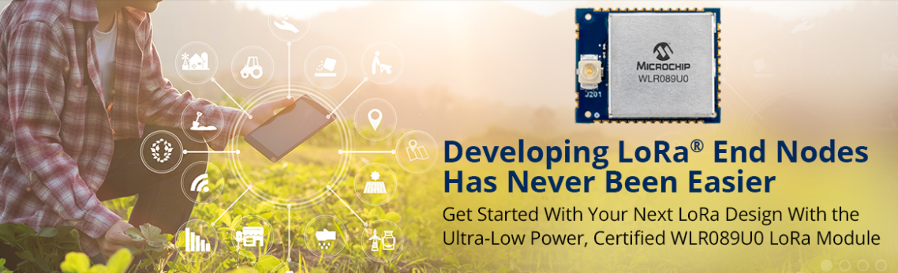
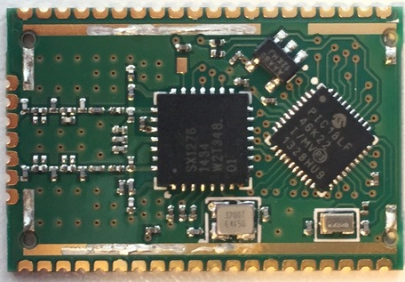
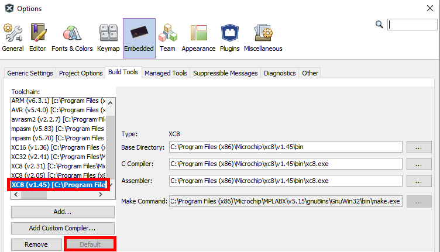
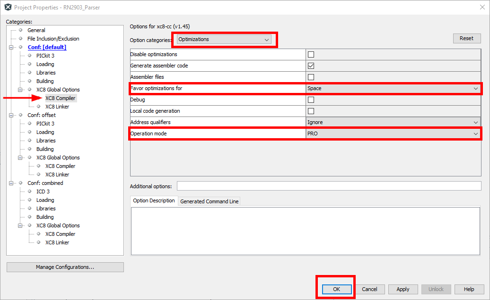
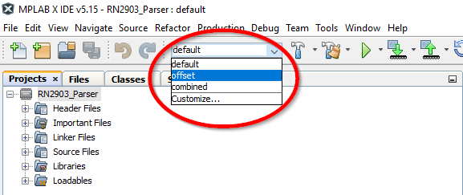
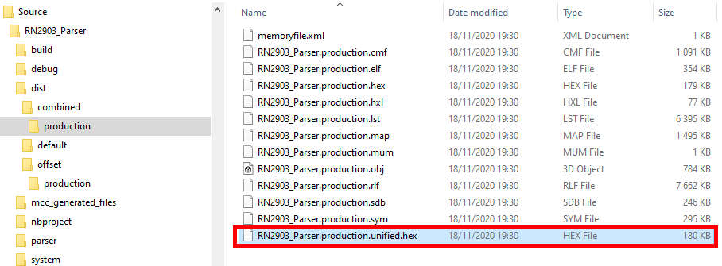
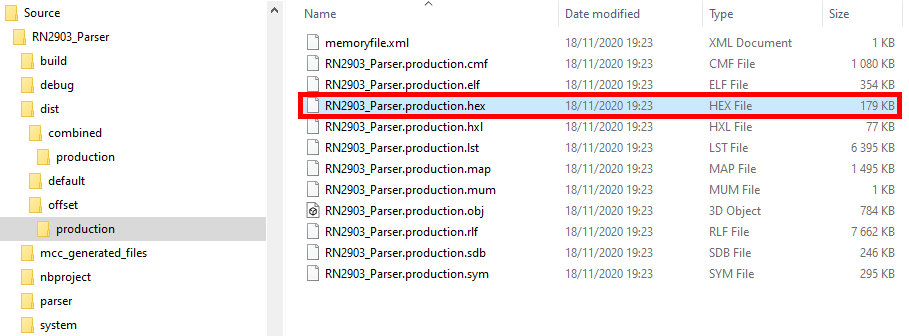
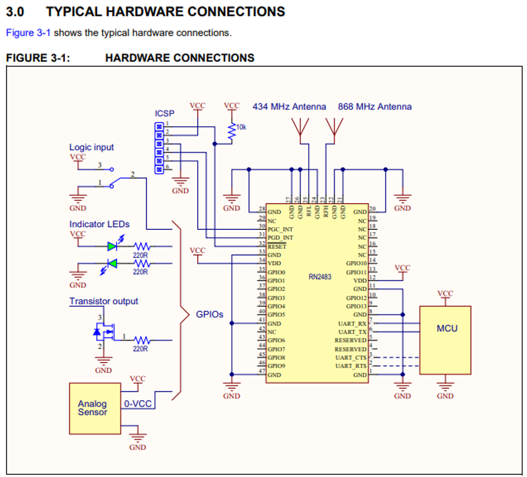
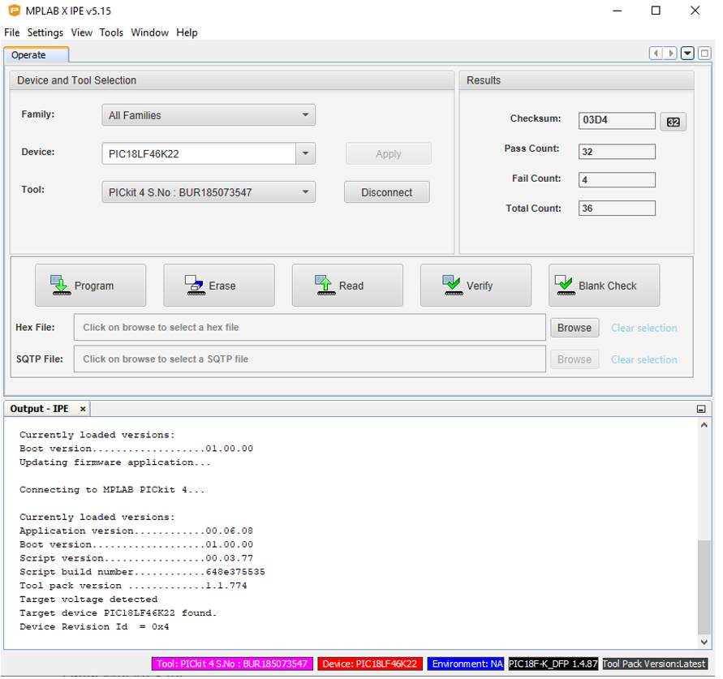
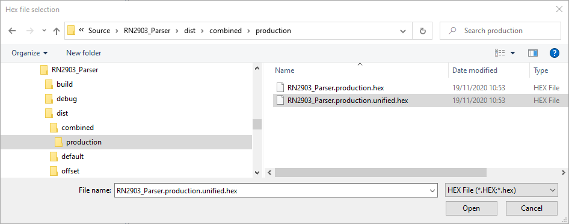

# RN2xx3_LORAWAN_FIRMWARE
> "Wireless Made Easy!" - Open sourcing the latest RN2xx3 beta firmware for self-support, self-maintenance and self-programming

Devices: | **RN2483A | RN2903A**

**For Latest and Greatest LoRaWAN solutions, check out the [WLR089U0 Module](https://www.microchip.com/wwwproducts/en/WLR089U0) and [SAM R34 IC](https://www.microchip.com/wwwproducts/en/ATSAMR34J18).**

## ⚠ Disclaimer

<b>
Subject to your compliance with these terms, you may use Microchip software and any derivatives exclusively with Microchip products. It is your responsibility to comply with third party license terms applicable to your use of third party software (including open source software) that may accompany Microchip software. 
THIS SOFTWARE IS SUPPLIED BY MICROCHIP "AS IS". NO WARRANTIES, WHETHER EXPRESS, IMPLIED OR STATUTORY, APPLY TO THIS SOFTWARE, INCLUDING ANY IMPLIED WARRANTIES OF NON-INFRINGEMENT, MERCHANTABILITY, AND FITNESS FOR A PARTICULAR PURPOSE. 
IN NO EVENT WILL MICROCHIP BE LIABLE FOR ANY INDIRECT, SPECIAL, PUNITIVE, INCIDENTAL OR CONSEQUENTIAL LOSS, DAMAGE, COST OR EXPENSE OF ANY KIND WHATSOEVER RELATED TO THE SOFTWARE, HOWEVER CAUSED, EVEN IF MICROCHIP HAS BEEN ADVISED OF THE POSSIBILITY OR THE DAMAGES ARE FORESEEABLE. TO THE FULLEST EXTENT ALLOWED BY LAW, MICROCHIP'S TOTAL LIABILITY ON ALL CLAIMS IN ANY WAY RELATED TO THIS SOFTWARE WILL NOT EXCEED THE AMOUNT OF FEES, IF ANY, THAT YOU HAVE PAID DIRECTLY TO MICROCHIP FOR THIS SOFTWARE.

</b>

> Interact with your peers about this software in [LoRa Forum](https://www.microchip.com/forums/f512.aspx) and through [LoRaWAN community](https://lora-alliance.org/).

## Important considerations

<b>THE SOFTWARE ARE PROVIDED "AS IS" AND GIVE A PATH FOR SELF-SUPPORT AND SELF-MAINTENANCE.

- SOFTWARE CAN BE MODIFIED AND APPROPRIATED FOR SELF-USAGE AND SELF-RESPONSIBILITY.
- NONE OF THE SOFTWARE PART OF THIS REPOSITORY ARE ACTIVELY SUPPORTED.
- NO RN2xx3 MODULE WILL COME PRE-PROGRAMMED BY MICROCHIP WITH ANY OF THOSE VERSION.
- THE MODULE MUST BE SELF-PROGRAMMED IF REQUIRED.
- SOFTWARE HAVE NOT BEEN FULLY TESTED.
- SOFTWARE HAVE NOT BEEN CERTIFIED.
- SOFTWARE HAVE NOT BEEN VALIDATED WITH THE LORAWAN CERTIFICATION TEST TOOL.
- EU & NA SOFTWARE HAVE BEEN IMPLEMENTED WITH [LORAWAN ALLIANCE SPECIFICATION v1.0.2](https://lora-alliance.org/resource-hub/lorawanr-specification-v102) and [LORAWAN REGIONAL PARAMETERS v1.0.2](https://lora-alliance.org/resource-hub/lorawanr-regional-parameters-v102rb).
- FOR LATEST AND GREATEST LORAWAN SOLUTIONS, CHECK OUT THE [WLR089U0 MODULE](https://www.microchip.com/wwwproducts/en/WLR089U0) AND [SAM R34 IC](https://www.microchip.com/wwwproducts/en/ATSAMR34J18).
</b>

## Resources

- [RN2483 Landing page](https://www.microchip.com/wwwproducts/en/RN2483)
- [RN2903 Landing page](https://www.microchip.com/wwwproducts/en/RN2903)

## A la carte

1. [Hardware Platforms](#step1)
1. [Software Overview](#step2)
1. [Software Environment Setup](#step3)
1. [Module Programming](#step4)

## Hardware Platforms

### Modules

* RN2483A-I/RMxxx
* RN2903A-I/RMxxx

### Demo boards

[RN-2483-PICTAIL](https://www.microchip.com/DevelopmentTools/ProductDetails/PartNO/RN-2483-PICTAIL)\
[DM164138 - 868MHz RN2483 LORA-MOTE](https://www.microchip.com/DevelopmentTools/ProductDetails/PartNO/DM164138)

[RN-29003-PICTAIL](https://www.microchip.com/DevelopmentTools/ProductDetails/PartNO/RN-2903-PICTAIL)\
[DM164139 - 915MHz RN2903 LORA-MOTE](https://www.microchip.com/DevelopmentTools/ProductDetails/PartNO/DM164139)

## Software Overview

[Clone/Download](https://docs.github.com/en/free-pro-team@latest/github/creating-cloning-and-archiving-repositories/cloning-a-repository) the current repo to get the software.

The present repository contains the following BETA Firmware for the [PIC18LF46K22](https://www.microchip.com/wwwproducts/en/PIC18F46K22) microcontroller:

- RN2483 EU v1.06 RC3 source code (LoRaWAN specification 1.0.2)
- RN2903 NA v1.06 RC6 source code (LoRaWAN specification 1.0.2)
- RN2903 AS v1.06 source code (LoRaWAN specification 1.0.2)
- RN2903 AU v1.03 source code (LoRaWAN specification 1.0.1)

It also contains, the following legacy versions of firmware:

- RN2483 EU v1.03 source code (LoRaWAN specification 1.0.1)
- RN2483 EU v1.04 source code (LoRaWAN specification 1.0.1)
- RN2483 EU v1.05 source code (LoRaWAN specification 1.0.2)
- RN2903 NA v1.03 source code (LoRaWAN specification 1.0.1)
- RN2903 NA v1.05 source code (LoRaWAN specification 1.0.2)

And it contains sample cert. applications for the PIC18LF25K50 Host microcontroller:

- Host MCU software used for LoRaWAN Alliance Cert 1.0.1 for the RN2483-pictail/mote
- Host MCU software used for LoRaWAN Alliance Cert 1.0.1 for the RN2903-pictail/mote

## Software Environment Setup

### Software Requirements

- [MPLAB X IDE v5.15](http://ww1.microchip.com/downloads/en/DeviceDoc/MPLABX-v5.15-windows-installer.exe)
- [XC8 compiler PRO v1.45](http://ww1.microchip.com/downloads/en/DeviceDoc/xc8-v1.45-full-install-windows-installer.exe) (requires Software License)

Checkout the [archive page](https://www.microchip.com/development-tools/pic-and-dspic-downloads-archive).

### IDE Setup

- Open MPLAB X IDE
- Make sure required XC8 compiler is selected by default in **Tools -> Options -> Embedded**

### Project Setup

- Open the requested LoRaWAN project from **File -> Open Project** (e.g. `RN2903NA_1.0.6_RC6\Source`)
- Open the project properties from **File -> Project Properties**
- Apply the requested XC8 compiler version for all the configurations (default, offset, combined)

- For all the 3 configurations (default, offset, combined), make sure XC8 Compiler optimizations options are set for:
  * Favor optimization for: **Space**
  * Operation mode: **PRO**

- Select between **offset** or **combined** from the selection box

> Offset configuration is configuring the project in order to compile the project without the bootloader code
> Combined configuration is configuring the project in order to compile both the project and the bootloader code

- For combined configuration, the **HEX** file generated `RN2xx3_Parser.production.unified.hex` is located into `dist/combined/production`

- For offset configuration, the **HEX** file generated `RN2xx3_Parser.production.hex` is located into `dist/offset/production`

## Module Programming

In addition to the LoRa Transceiver, the RN2xx3 modules integrate a [PIC18LF46K22](https://www.microchip.com/wwwproducts/en/PIC18F46K22) microcontroller which come with 64kB of Flash and 4kB of RAM. The LoRaWAN Firmware resides into the memory of the PIC18LF46K22 microcontroller.

### Combined configuration

#### Requirement

Requires Programming tool such as [MPLAB ICD4](https://www.microchip.com/Developmenttools/ProductDetails/DV164045) or [MPLAB PICkit4](https://www.microchip.com/Developmenttools/ProductDetails/PG164140)

#### Setup

Connect the programming tool to ICSP pins (PCG_INT, PGD_INT, RESET, GND, VCC) as shown in the [datasheet](http://ww1.microchip.com/downloads/en/DeviceDoc/RN2483-Data-Sheet-DS50002346E.pdf).

#### Programming

* Open MPLAB X IPE
* Select **PIC18LF46K22** target device
* Select the programming tool
* Click **Apply**
* Click **Connect**

* Browse for the required HEX file `RN2xx3_Parser.production.unified.hex` located into `dist/combined/production`

* **Program** the device
* Click **Disconnect**
* Remove the programming tool connection

### Offset configuration

To update the RN2483/RN2903 firmware using Bootloader with a Computer Host or with an Embedded Host checkout the **Chapter 3. Bootloader Usage** of the [User Guide](https://ww1.microchip.com/downloads/en/DeviceDoc/RN2483-LoRa-Technology-Module-Command-Reference-User-Guide-DS40001784G.pdf)

Make sure to use the HEX file `RN2xx3_Parser.production.hex` located into `dist/offset/production`

